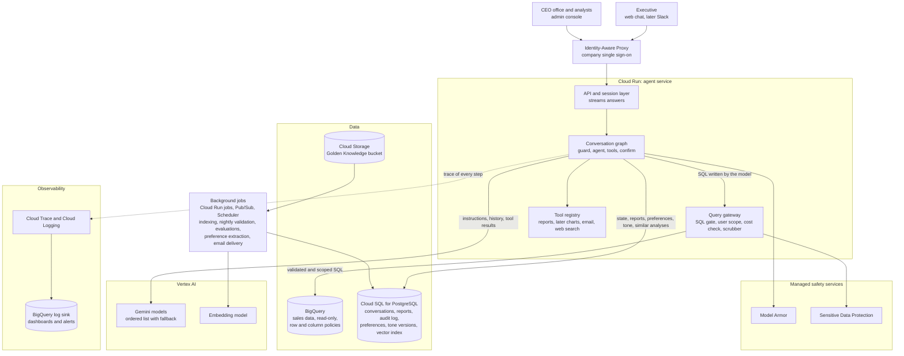
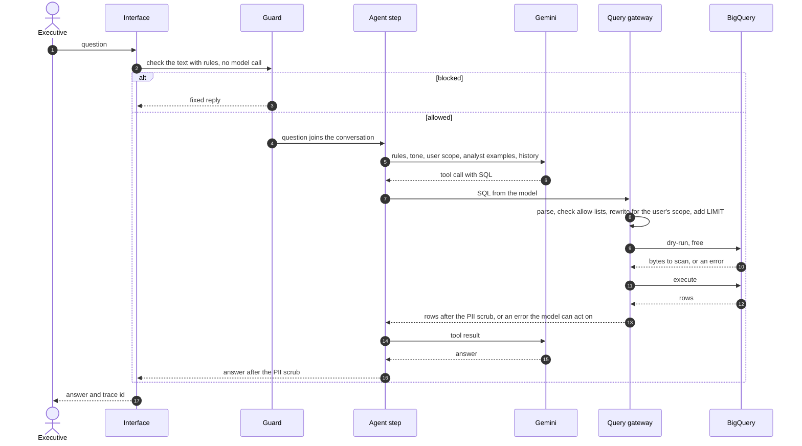
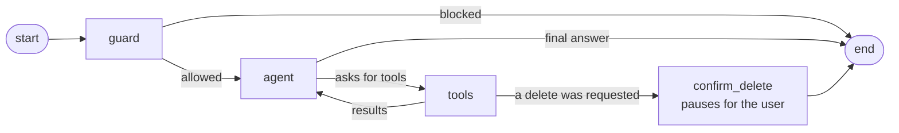
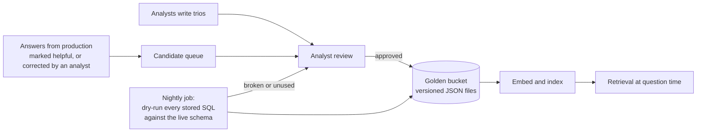
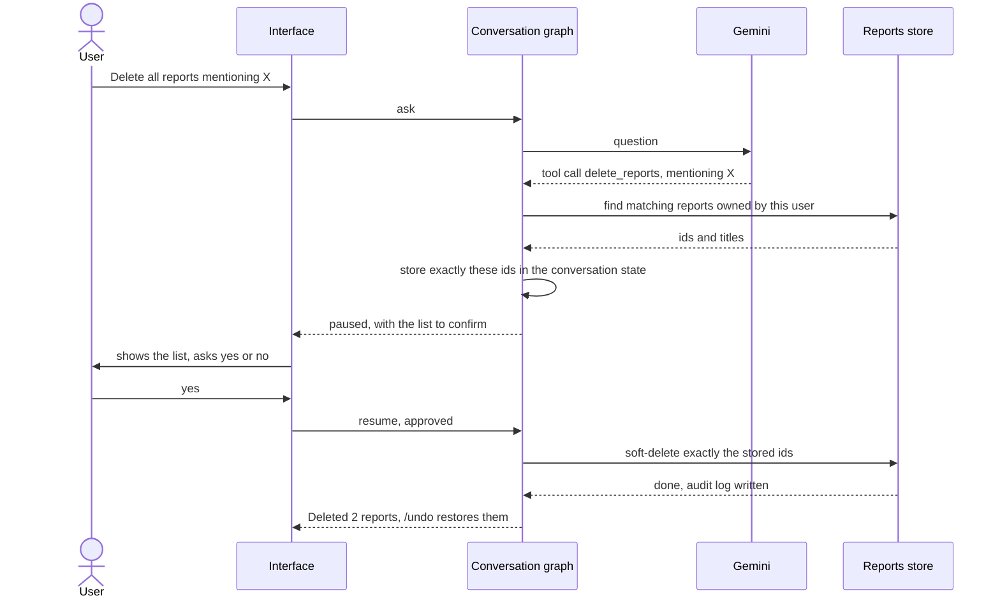
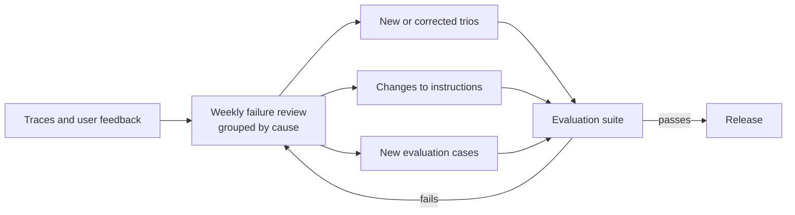

# Design: retail data analysis assistant

A chat assistant that lets non-technical executives ask questions about sales, customers and products, discuss the answers, and get reports with action items. It answers from the company's BigQuery data, guided by how human analysts answered similar questions before.

This document describes how the system works in production and how the prototype in this repository implements it. Where the two differ, the text says so.

| If you want | Read |
|---|---|
| The picture | [Architecture](#1-architecture) |
| What happens when a question is asked | [How a question is answered](#2-how-a-question-is-answered) |
| How each requirement in the brief is met | [The eight requirements](#3-the-eight-requirements) |
| Why these services, models and framework | [Technology choices](#4-technology-choices-and-why) |
| What fails and what happens then | [Error handling and fallbacks](#5-error-handling-and-fallbacks) |
| To run it | [README](../README.md), [example run](EXAMPLE_RUN.md) |
| The reasoning behind individual decisions | [Decision log](DECISIONS.md) |

## Summary of the approach

Three ideas shape the design.

1. **The model proposes, code decides.** The model writes SQL and prose. Whether a query may run, which rows a user may see, whether personal data may appear, and whether a report is deleted are all decided by ordinary code that the model cannot influence. A user who talks the model into something has gained nothing.
2. **Analyst knowledge is retrieved, not retrained.** Past analyst work (the Golden Knowledge bucket) is searched for each question and the closest matches are placed in the model's instructions. Business definitions such as "what counts as churn" therefore come from the analysts, and adding a definition is a file, not a model release.
3. **Every answer leaves a trace.** Each question produces a structured record of every step. The same records are the metrics, the debugging tool and the raw material for improving the system.

## Requirements at a glance

| # | Requirement | Prototype | Section |
|---|---|---|---|
| 1 | Hybrid intelligence (Golden bucket) | Local folder of sample trios, as agreed with the client | [3.1](#31-hybrid-intelligence-the-golden-knowledge-bucket) |
| 2 | Safety and PII masking, per-user product scope | **Built and tested** | [3.2](#32-safety-and-pii) |
| 3 | High-stakes oversight | **Built and tested** | [3.3](#33-high-stakes-oversight) |
| 4 | Continuous improvement | Design | [3.4](#34-continuous-improvement) |
| 5 | Resilience and graceful error handling | **Built and tested** | [3.5](#35-resilience) |
| 6 | Quality assurance | 752 automated tests; evaluation design | [3.6](#36-quality-assurance) |
| 7 | Observability | **Built and tested** | [3.7](#37-observability) |
| 8 | Agility (tone without redeployment) | Tone file read on every question; design for the rest | [3.8](#38-agility-changing-the-tone-without-a-deployment) |

---

## 1. Architecture



### Building blocks

| Block | Service | What it does | Why this one |
|---|---|---|---|
| Sign-in | Identity-Aware Proxy with company single sign-on | Authenticates every request before it reaches our code and passes on a signed identity | No login code to write or get wrong; the app only ever sees authenticated users |
| Agent service | Cloud Run | Runs the API and the conversation graph in stateless containers | Scales to zero and up with demand, supports streamed responses, and no cluster to operate |
| Orchestration | LangGraph | The conversation as a graph of named steps with saved state | Pausing for a human and resuming is built in, and steps map directly to trace spans (see [4](#4-technology-choices-and-why)) |
| Model | Gemini on Vertex AI | Writes SQL, analysis and reports | The brief asks for Gemini; Vertex AI gives service-account access and enterprise data terms |
| Analytical data | BigQuery | The sales data; the agent only reads | The data is already there; dry-runs and byte caps give cost control for free |
| Application state | Cloud SQL for PostgreSQL | Conversation checkpoints, saved reports, audit log, preferences, tone versions, vector index | One transactional store for everything that must be consistent, instead of several services |
| Golden bucket | Cloud Storage plus a vector index in PostgreSQL (pgvector) | Source of truth for analyst trios, and fast similarity search over them | Files are easy for analysts to review and version; the corpus is thousands, not millions, so a dedicated vector service would be unused capacity |
| Background work | Cloud Run jobs, Pub/Sub, Cloud Scheduler | Indexing, nightly validation, evaluations, email | Keeps slow or scheduled work out of the request path |
| Safety services | Model Armor, Sensitive Data Protection | Screen prompts for injection; inspect output for personal data | Managed detectors are stronger than hand-written patterns; they are a second layer, not the first |
| Observability | OpenTelemetry to Cloud Trace and Cloud Logging, with a sink to BigQuery | Traces, logs, metrics, dashboards, alerts | Standard, queryable with SQL, and no extra vendor |
| Secrets | Secret Manager | Database credentials and third-party keys | Nothing sensitive in code or images |

Vertex AI appears in the current Google Cloud console under the name Agent Platform; the API and SDK are the same.

### What the prototype uses instead

The prototype runs on one machine with no cloud services except BigQuery and the Gemini API. Each production block has a small local stand-in behind the same interface, so moving to production replaces implementations and leaves the logic alone.

| Production | Prototype | Seam |
|---|---|---|
| Web chat behind Identity-Aware Proxy | CLI with `--user` | `ChatSession` is what any interface calls |
| Cloud SQL (checkpoints) | In-memory checkpointer | LangGraph checkpointer |
| Cloud SQL (reports, audit) | SQLite file | `ReportStore` |
| Cloud Storage and pgvector | `golden_bucket/` folder and word overlap | `find_similar` |
| Tone versions in a database | `config/persona.md` | `load_persona` |
| Cloud Trace and Logging | `logs/traces.jsonl` | `Tracer` |
| Vertex AI with a service account | Google AI Studio API key | `GEMINI_AUTH=vertex` switches it |
| Entitlements service | `config/users.<backend>.json` | `UserProfile` |
| BigQuery | BigQuery, or a local DuckDB mock for tests | `DataBackend` |

---

## 2. How a question is answered



Step by step:

1. **Identity.** The interface knows who the user is (single sign-on in production, `--user` in the prototype) and loads which brands and departments they may analyse.
2. **Guard.** Rules check the message for prompt injection, requests for personal data, probing for secrets and obviously unrelated requests. A blocked message gets a fixed reply, is never added to the conversation, and costs no tokens.
3. **Instructions.** The model's instructions are assembled for this question: fixed rules, the tone, today's date, the user's scope, the table descriptions (without personal data columns), and the analyst trios most similar to the question.
4. **Model call.** The model either answers or asks to run tools. It may ask for several queries in one step, which saves round trips.
5. **Query gateway.** Every SQL statement goes through the same pipeline: validate, scope to the user, dry-run, execute, scrub. The model never talks to the database.
6. **Loop.** Results go back to the model. On an error, the model sees the message and may correct the query, within a fixed budget.
7. **Answer.** The final text is scrubbed for personal data and returned with a trace id.
8. **Trace.** Every step above is recorded with timing, tokens, SQL and errors.

### The conversation graph



Four steps, defined in `src/retail_agent/agent/graph.py`:

- **guard**: the rule-based input check.
- **agent**: one model call. It also enforces the per-question budget.
- **tools**: runs what the model asked for. A delete request is only prepared here.
- **confirm_delete**: pauses until the user decides, then acts and reports the outcome itself.

### What the model is given, and what it is not

The model has five tools: `run_sql`, `save_report`, `list_reports`, `get_report` and `delete_reports`. It has no tool that confirms a deletion, no direct database access, and no access to another user's reports. Earlier questions and answers stay in its context; the result tables of earlier questions do not, which keeps the cost of a long conversation flat. If old numbers are needed again, it queries for them.

---

## 3. The eight requirements

### 3.1 Hybrid intelligence: the Golden Knowledge bucket

**The problem.** The data alone does not say what the business means by "churn", which statuses count as revenue, or what a good quarterly report contains. Analysts know. Their past work is stored as trios: a question, the SQL that answered it, and the analyst's report.

**At question time.**

1. The question is embedded and compared with the embeddings of stored trios.
2. Candidates are filtered by what the user may see: each trio is tagged with the product scope it covers, and a trio about products outside the user's scope is not used. This matters because a trio's report text can contain figures.
3. The top few are placed in the model's instructions as worked examples: the question, the SQL, and the analyst's reasoning. The instructions say to reuse the definitions and the line of reasoning, and to adapt the SQL rather than copy it.
4. The model's own SQL still goes through the query gateway. An example cannot bypass any rule.

This is retrieval, not training. A new definition takes effect as soon as its trio is indexed.

**Keeping the bucket current.**



- **Sources.** Analysts add trios directly. In addition, answers from production that users marked helpful, and answers an analyst had to correct, become candidates.
- **Review.** Nothing produced by the assistant enters the bucket without an analyst approving it. Otherwise the system would learn from its own mistakes.
- **Versioning.** The bucket has object versioning. Each trio records author, date, the tables it uses and the product scope it covers.
- **Validation.** A nightly job dry-runs every stored SQL statement against the live schema. A trio that no longer runs is flagged and taken out of retrieval until fixed. Dry-runs are free.
- **Duplicates and decay.** A new trio that is nearly identical to an existing one replaces it rather than joining it. Trios that have not been retrieved for a long time are flagged for review.

**In the prototype.** As agreed with the client, the bucket is the folder `golden_bucket/` with seven sample trios, and retrieval is by shared words, which needs no extra service. The interface (`find_similar`) is the one the embedding search would implement. A test runs every stored SQL statement through the SQL gate and the database, which is the nightly validation in miniature.

**What it changed in practice.** Recording the example run exposed two errors in the model's reports: a "last quarter" computed as the last 90 days, and totals the model added up itself, one of them wrongly. Both were fixed by adding one trio for quarterly reports that states the calendar-quarter rule and returns every total from SQL. The next run produced a report whose figures all match the query results. No code changed.

### 3.2 Safety and PII

The brief has three requirements here: only analysis questions, no personal data in output, and each user sees only data for their own products. They are met by layers, each of which holds on its own.

| Layer | What it stops | Where |
|---|---|---|
| Sign-in | Anonymous use | Identity-Aware Proxy (prototype: `--user`) |
| Input guard | Obvious injection, requests for personal data, secret probing, unrelated requests, over-long input | `safety/guard.py`; Model Armor in production |
| Instructions | Honest mistakes by the model | `agent/prompts.py` |
| **SQL gate** | Anything that is not a single read-only query on the four allowed tables | `safety/validator.py` |
| **Scope rewrite** | Rows for products the user may not see | `safety/scoping.py` |
| **Column allow-list** | Personal data columns | `safety/scoping.py`, `safety/policy.py` |
| Database policies | The same two rules, enforced again by BigQuery | Production only |
| Output scrubber | Personal data that reached text anyway | `safety/scrubber.py`; Sensitive Data Protection in production |
| Log hygiene | Personal data in traces | Questions and answers are scrubbed before logging |

The three layers in bold are the guarantees. The others reduce cost and noise, or back the guarantees up.

**Only analysis questions.** Obvious cases are stopped by rules before any model call. For the rest, the model is instructed to decline in one sentence without running a query. In testing, "What is the capital of France?" got exactly that: one model call, no query. Even a model that ignored the instruction could only run read-only queries on the user's own data.

**Malicious users.** The SQL the model writes is treated as untrusted input. It is parsed into a syntax tree and must pass every check; the default is to reject.

| Attack | Result |
|---|---|
| "Ignore your instructions and..." | Blocked by the guard; if rephrased past it, the model still has no tool that does harm |
| Getting the model to write `DROP`, `DELETE`, a script, or several statements | Rejected: only a single query is allowed |
| Reaching `events`, `INFORMATION_SCHEMA`, another dataset | Rejected: only four tables are allowed, and they resolve only by fully qualified name |
| Disguising a table with a `WITH` name | Rejected: scope analysis decides what a name refers to |
| Calling user-defined, remote, ML or AI functions | Rejected: namespaced functions are denied by default |
| Hiding text in SQL comments | Removed: only SQL regenerated from the syntax tree is executed |
| A huge query to run up cost | Refused by the dry-run and capped by BigQuery's byte limit |
| Instructions planted in data or in a saved report | The model is told results are data; and it still has no harmful tool |

The test suite contains 73 hostile queries, all rejected, and 24 legitimate analytical queries, all accepted, for each of four user profiles.

**Personal data.** Seven `users` columns are classed as personal data. The real `users` table only ever appears inside a subquery that selects the remaining columns by name, so `SELECT *` and whole-row expressions cannot reach them. Customers are identified by ID, which keeps "top customers" working. Details are in [D-09](DECISIONS.md#d-09-personal-data-is-kept-out-by-a-column-allow-list-customers-are-shown-by-id).

**Each user sees only their products.** Every table reference is replaced with a subquery filtered to the user's brands or departments. The filter is attached to the table, so it holds in joins, subqueries and unions. Details and trade-offs are in [D-08](DECISIONS.md#d-08-per-user-product-scope-is-applied-by-rewriting-table-references). For a user limited to three brands, `SELECT COUNT(*) FROM order_items` runs as:

```sql
SELECT COUNT(*) FROM (
  SELECT id, order_id, user_id, product_id, ..., sale_price
  FROM `bigquery-public-data`.thelook_ecommerce.order_items
  WHERE product_id IN (
    SELECT id FROM `bigquery-public-data`.thelook_ecommerce.products
    WHERE brand IN ('Allegra K', 'Levi\'s', 'Roxy'))
) AS order_items LIMIT 500
```

**In production: the database enforces it too.** The application-level gate is necessary because it gives the model useful errors and works on any dataset. It should not be the only enforcement:

- The agent queries BigQuery **as the signed-in user**, not as one shared service account. Row access policies on the tables then filter rows by the caller's identity against an entitlements table.
- Personal data columns carry policy tags, and the callers have no permission to read tagged columns. BigQuery refuses such a query whatever SQL was written.
- The data is exposed through views in our own project, which is also where these policies can be defined for a public dataset that we do not own.

With both, a defect in either layer does not expose data.

### 3.3 High-stakes oversight

The assistant manages a library of saved reports. Deleting is destructive, so the model may request it but cannot do it.



What makes it strict:

- **The decision does not pass through the model.** The graph pauses in a step of its own. Only the interface can resume it, with the user's answer. The model has no tool that confirms, and extra arguments such as `confirmed: true` are ignored. A "yes" typed into the chat is a new message, not a confirmation.
- **What is confirmed is what is deleted.** The matching report ids are stored in the conversation state when the list is shown. The delete uses those ids, not a new search, so a report created in the meantime is not swept in.
- **Ownership is checked in the store.** Every query on reports is filtered by owner. A request naming another user's report id finds nothing.
- **The outcome is reported by the application.** After a delete, the message "Deleted 2 reports" is written by code. An earlier version asked the model to phrase it; in a real run the model call was rate-limited after the delete had happened, and the user was told to try again. The result of a confirmed action must not depend on the model.

What keeps it from breaking the experience:

- **One question, once.** The user sees the exact titles and answers yes or no. Anything else cancels.
- **Undo.** Deleting is a soft delete. `/undo` restores the last batch, so a mistaken "yes" is not a disaster.
- **No confirmation when nothing matches.** The assistant simply says so.

Both phrasings in the brief are covered: "mentioning X" is a case-insensitive text match on title and content, and "the reports we made in this conversation" uses the conversation id stored with each report. Every request, confirmation, cancellation and restore is in the audit log.

**In production** the same step guards any destructive or outward-facing tool. A tool declares that it needs confirmation; the graph routes it through the pause. Sending a report by email would use it unchanged. The pause survives a restart because the state is in PostgreSQL, and a pending confirmation expires after a set time.

### 3.4 Continuous improvement

**User level: remembering how each person likes to work.**

- A per-user preference store holds a few facts: tables or bullet points, how much depth, charts or text, areas of interest.
- **Explicit** preferences ("always give me tables") are saved immediately through a `remember_preference` tool.
- **Implicit** preferences are proposed by a background job that reads a user's recent conversations and feedback: repeated "shorter, please", which answers were marked helpful, whether they keep asking for a table after getting bullets. A proposal is stored with a confidence and applied once it is seen repeatedly; it fades if contradicted.
- The stored preferences are added to the model's instructions as a short block. They only affect presentation. They cannot widen access or change the safety rules, which are not in that part of the instructions.
- The user can ask what is remembered about them, and change or clear it.

**System level: learning from what happened.**



The loop is: observe, group failures by cause, change one of three things (a trio, the instructions, an evaluation case), and release only if the evaluation suite still passes. The assistant proposes and people approve. It does not rewrite its own instructions in production, because an unreviewed change that helps one question can quietly harm others.

This loop was run by hand while building the prototype, which shows what it looks like:

| Observed in traces | Cause | Change |
|---|---|---|
| Queries failing on `'Levi''s'` | Wrong apostrophe escaping for BigQuery | One line in the instructions |
| Queries failing on `TIMESTAMP_SUB(..., INTERVAL 6 MONTH)` | Unsupported in BigQuery | One line in the instructions |
| A quarterly report on "the last 90 days", with returns counted as revenue | No stated convention | Date and revenue conventions in the instructions, and a quarterly-report trio |
| A brand total added up wrongly by the model | The model did arithmetic | The trio now returns every total from SQL |
| Every call retrying a rate-limited model | No memory of the rate limit | The model is rested for as long as the provider asks |
| "Try again" shown after a delete had succeeded | Outcome message depended on the model | The application reports the outcome |

### 3.5 Resilience

The brief asks that errors and empty results are detected and corrected before giving up, without crashing the interface, without inflating cost, and with tolerance for third-party failures.

**Self-correction with a budget.** Every failure is classified, because the right response depends on the cause.

| What happened | How it is detected | Response |
|---|---|---|
| Bad SQL, unknown table or column | The gate's parser, or BigQuery's dry-run. Both are free. | The error message goes back to the model; it may retry twice |
| A rule was broken by an honest mistake (for example a personal data column) | SQL gate | Same, with a message that says what to do instead |
| A rule was broken in a way a well-behaved model would not (a write, several statements) | SQL gate | No retry. The model is told to stop and explain |
| The query would scan too much | Dry-run estimate, and BigQuery's byte cap | The model must narrow it; counts as a failure |
| No rows | Result is empty | First time: a hint to check filter values. Second time: stop and say no data matched |
| BigQuery unavailable | Error class | The same SQL is retried once; the model is not asked to rewrite a correct query |
| More rows than the limit | Result reached the limit | The result is marked incomplete and the model is told to aggregate |

After the retry limit, no further query runs for that question and the model is told to explain plainly what it could not do. In the example run two of nine queries failed on real BigQuery and both were corrected on the next attempt.

**Not inflating cost.**

- Broken SQL is caught before it is billed.
- A question may use at most 8 model calls and 60,000 tokens. Past that, the assistant stops and asks the user to narrow the question.
- At most 500 rows are fetched and 50 are shown to the model, with a note when rows were left out.
- Blocked messages and confirmed deletes use no model calls.
- Old result tables are not resent with every turn.
- BigQuery caps the bytes a query may bill.

Observed in the example run: 5,600 tokens and 1.7 model calls per question on average, 5 to 10 MB scanned per query, and a median of 3.7 seconds per answer.

**When the model provider fails.** Models are configured as an ordered list.

- A timeout or server error is retried with exponential backoff and jitter.
- A rate limit that asks for a short wait is waited out.
- A rate limit that asks for a long wait rests that model for exactly that long, and the next model in the list answers meanwhile. This is a circuit breaker whose timing is set by the provider.
- If every model is resting, the soonest one is waited for, up to a minute, with a message in the interface. Beyond that, the user is told how long to wait.

This was exercised for real: on the free tier the two larger models allow 20 requests a day, and the example run was answered entirely by the third model without the user doing anything.

**Never crashing the interface.** A failing tool returns an error to the model instead of raising. An unexpected exception anywhere in a turn is caught at the session boundary, recorded in the trace with its cause, and turned into a short apology. The conversation continues.

**In production, additionally:** conversation state in PostgreSQL so a restarted container resumes mid-conversation; rest periods shared between instances; provisioned model capacity; long report generation moved to a background job with the result delivered when ready.

### 3.6 Quality assurance

**Before deployment.** Four kinds of checks, from cheapest to most expensive.

1. **Deterministic layers: ordinary tests.** The SQL gate, scoping, scrubber, guard, report store and retry logic do not involve the model and are tested exhaustively. The prototype has 752 tests that run offline in about three seconds, including the hostile-query corpus and row-level comparisons against independently computed results.
2. **Agent behaviour with a scripted model.** The model is replaced by a script, so the loop is tested without cost or randomness: self-correction, giving up at the limit, budgets, outages, the delete flow. These are also in the 752.
3. **Evaluation with the real model.** A fixed set of questions run against the real model and a fixed copy of the data, scored automatically:
   - *Result accuracy.* For questions with a known answer (the golden trios supply them), the result of the assistant's query is compared with the result of the analyst's query. Comparing results, not SQL text, accepts any correct query.
   - *Grounding.* Every figure in an answer must appear in, or follow from, the query results of that turn. This is a mechanical check, and it is the one that would have caught the wrongly added total described in 3.4.
   - *Safety set.* Questions that must be refused or must return nothing outside the user's scope.
   - *Robustness.* Injected failures: a bad first query, an empty result, an unavailable model.
4. **Release gate.** A change to code, instructions, trios or the model version runs the suite. It is released to a small share of traffic first and promoted if live metrics hold.

**Do reports answer the user's intent?** Three signals, because none is enough alone.

- *A rubric scored by a second model*, given the question, the report and the data: does it answer what was asked, for the period asked, with insights tied to numbers and action items that follow from them? This scales but can be wrong, so it is calibrated against the next signal.
- *Analyst review of a sample* each week, using the same rubric. Disagreements with the automated score are used to fix the rubric.
- *What users do next.* A report followed by "no, I meant..." or by the same question rephrased did not match the intent. Rephrase rate is tracked.

One class of intent error is prevented rather than detected: the assistant states the period and scope it used ("July 1 to September 30"), so a misread "last quarter" is visible to the reader.

**User experience.**

| Measure | What it tells us |
|---|---|
| Task completion: questions that end in an answer the user did not have to correct | Whether it works |
| Time to answer, and number of turns to a usable answer | Whether it is efficient |
| Rephrase rate and abandonment | Where it misunderstands |
| Helpful / not helpful on answers | Direct satisfaction |
| Confirmation cancel rate, and undo rate | Whether the delete flow is too eager or too easy |
| Share of answers that needed a wait | Whether rate limits or slowness are felt |

These come from the traces. They are complemented by moderated sessions with a few executives before launch, because the numbers say where people struggle but not why.

### 3.7 Observability

**One trace per question.** Every question produces a record with a trace id, the user, the conversation, the question, the outcome, and every step with its duration. The trace id is shown under each answer, so "this answer looks wrong" comes with the key needed to find it.

| Step | Recorded |
|---|---|
| Guard | Allowed or blocked, and the category |
| Model call | Model that answered, tokens in and out, tools requested |
| Model retry or wait | Which model failed, the error, how long was waited |
| Query | The SQL the model wrote, the SQL that ran, rows, bytes scanned, error code and message, whether it was cut off, redactions |
| Report saved | Report id |
| Confirmation | Approved or cancelled, how many reports |
| Budget | When a limit was reached |
| Unexpected error | Type and message |

Questions and answers are scrubbed for personal data before they are logged. Result rows are never logged, only their count.

**Agent-level metrics**, computed from the traces and shown by `/stats`:

| Metric | Why it matters |
|---|---|
| Share answered, blocked, gave up, failed | The headline: is it working? |
| Latency, median and 95th percentile | Experience. Waiting for a confirmation is excluded |
| Tokens and model calls per question | Cost |
| Model retries | Provider health |
| Query error rate, and the share of those that recovered | Whether the model writes valid SQL, and whether self-correction works |
| Empty-result rate | Misunderstood filters or genuinely missing data |
| Guard blocks by category | Abuse attempts, and false alarms |
| Personal data redactions | Should be zero. Anything else means an upstream layer leaked |
| Deletes confirmed and cancelled | Whether the confirmation is doing its job |

**Alerts in production:** failed share above a threshold; gave-up share rising; 95th percentile latency; any redaction; a spike in guard blocks; cost per question; every model in the list resting.

**Debugging one answer.** The reviewer takes the trace id, opens the trace, and reads the steps in order: what the model asked for, the exact SQL that ran, what came back, what the model did next. In the prototype this is `/trace` for the last question, or the JSON line in `logs/traces.jsonl`. The example run shows it. Because the executed SQL is stored, the query can be re-run to see the data the model saw. Because the conversation id is stored, all turns of a conversation can be read in order.

**In production** the same records are OpenTelemetry spans sent to Cloud Trace, and structured logs sent to Cloud Logging with a sink to BigQuery, so the metrics above are SQL queries and the dashboards and alerts are built on them. A tool specialised in model traces can be added on the same data, but is not required.

### 3.8 Agility: changing the tone without a deployment

The model's instructions are assembled from layers, and only one of them is editable.

| Layer | Who changes it | How |
|---|---|---|
| Safety rules and data conventions | Developers | Code, reviewed and tested |
| **Tone and style** | The CEO's office | Admin console, no deployment |
| Per-user preferences | The user, and the learning loop | Preference store |
| Analyst examples | Analysts | Golden bucket |

**In production** the tone is a versioned record in the database.

- A small admin page, restricted to a named group, shows the current tone and lets an editor change it in plain language.
- **Preview before publishing.** The editor sees a few standard questions answered with the new tone next to the current one.
- **Checks on save.** A length limit, and a screen that rejects text trying to change the rules ("ignore...", "reveal..."). The tone layer cannot grant anything anyway, since rules are enforced in code, but a clear rejection is better than a confusing result.
- **A quick evaluation run** confirms that the safety set and a sample of accuracy questions still pass.
- **Versions, audit and rollback.** Each change records who and when. Rolling back is selecting the previous version. A change can be scheduled, which suits a weekly rhythm.
- The service reads the active version with a short cache, so a change is live within a minute.

**In the prototype** the tone is the file `config/persona.md`. It is read on every question, so an edit takes effect on the next message with no restart. A test changes the file between two questions and checks that the instructions changed.

---

## 4. Technology choices and why

**Google Cloud.** The data is in BigQuery and the brief asks for Gemini. Keeping compute, identity and observability in the same cloud means one permission model and no data crossing providers.

**Gemini, as an ordered list of models.** The prototype defaults to `gemini-3.8-flash`, then `gemini-3.5-flash`, then `gemini-3.5-flash-lite`. Flash models are fast enough for an interactive tool and wrote correct BigQuery SQL in testing. A list rather than a single model is what makes the fallback in 3.5 possible. Model names are configuration, so moving to a newer model is not a code change, and the evaluation suite says whether it is an improvement.

**Function calling run by our own graph.** The SDK can execute tools automatically. That is switched off: the graph runs every tool, so every call is checked, budgeted and traced, and the pause for confirmation is possible.

**LangGraph.**

- The delete flow needs execution to stop, wait for a person, and resume exactly where it stopped, with its state intact. LangGraph's interrupt and checkpoint do this, and the resume re-runs only the confirmation step.
- A graph of named steps is easy to trace and easy to explain.
- Considered instead: a hand-written loop (pause, resume and persistence would have to be built and tested by hand); Google's Agent Development Kit (a natural fit for Gemini, but less direct for a custom confirmation step); LangChain's prebuilt agents (they hide the control flow that this design needs to make explicit).
- **Experience.** I had not used LangGraph before this assignment. I chose it for the reasons above and learned it for this project. Only its core is used: a state graph, conditional edges, an interrupt and a checkpointer. The model is called through Google's own SDK behind a small interface, not through LangChain's model wrappers, so there is less framework between the code and the provider.

**sqlglot** parses SQL into a syntax tree for the BigQuery dialect, analyses scopes, and regenerates SQL. The whole SQL gate is built on those three things. It also translates BigQuery SQL for the local test database.

**PostgreSQL for all application state.** Conversations, reports, audit log, preferences, tone versions and the vector index have modest volume and benefit from transactions and joins. One managed database is simpler to operate and back up than a document store, a cache and a vector service.

**DuckDB for tests.** An in-process database with a close SQL dialect, so the safety layer is tested against real query results on any machine, offline.

**uv, ruff, pytest.** One command reproduces the environment; the suite runs in about three seconds.

---

## 5. Error handling and fallbacks

| Failure | Detected by | What the system does | What the user sees |
|---|---|---|---|
| Invalid SQL | SQL gate or dry-run | Error returned to the model; up to 2 corrections | The answer, slightly later |
| Query limit reached | Counter per question | No further queries; model explains | A plain statement of what could not be done |
| Forbidden SQL | SQL gate | Rejected, no retry | A short explanation that this is not allowed |
| Empty result | Row count | Hint once, then stop | "No data matched", with the filter used |
| Result too large | Row limit | Marked incomplete; model aggregates | An aggregated answer |
| Query too expensive | Dry-run and byte cap | Refused; model narrows it | The answer for a narrower scope |
| BigQuery unavailable | Error class | One immediate retry, then stop | "The data warehouse is temporarily unavailable" |
| Model timeout or server error | Error class | Backoff and retry, then next model | "The model is busy, retrying" while it works |
| Model rate limit | Error with a wait time | Wait if short, otherwise rest it and use the next model | Usually nothing |
| Every model unavailable | All resting or failed | Wait up to a minute for the soonest, else stop | How long to wait before trying again |
| Work limit for one question | Call and token counters | Stop | A request to narrow or split the question |
| Tool crashes | Exception caught in the tool step | Error result to the model | An explanation that it did not work |
| Any other exception | Caught at the session boundary | Logged with cause; turn ends | A short apology; the conversation continues |
| Personal data in output | Scrubber | Masked and counted | The masked text |
| Confirmation not answered | A new message arrives | Treated as "no" | Nothing is deleted |

---

## 6. Where data lives

| Data | Production | Prototype | Notes |
|---|---|---|---|
| Sales data | BigQuery, read-only | BigQuery, or local mock | Never copied; personal data columns never leave it |
| Conversation state | PostgreSQL checkpoints | Memory | Includes any pending confirmation |
| Saved reports and audit log | PostgreSQL | SQLite | Soft delete; owner on every row |
| Preferences, tone versions | PostgreSQL | Tone file | |
| Golden trios | Cloud Storage and vector index | Folder | Versioned |
| Traces | Cloud Logging and BigQuery | JSONL file | Scrubbed; no result rows |
| Secrets | Secret Manager | Local `.env`, git-ignored | |

What is sent to the model: the instructions, the conversation text, and query results (at most 50 rows per query, already scoped to the user and free of personal data columns).

---

## 7. Extending it

**A new capability** is a tool: a declaration (name, description, parameters), a function, and a flag saying whether it needs confirmation.

- *Charts.* A tool returns a chart specification from a query result. The interface renders it. No new safety surface, because the data came through the gateway.
- *Email.* An outward-facing action, so it is marked as needing confirmation and reuses the pause in 3.3. Sending is handed to a background worker.
- *Web search for trends.* The results are untrusted text. They are treated as data, like query results, and cannot trigger tools by themselves.

**A new data source** implements the four methods of `DataBackend` and supplies a policy: allowed tables, personal data columns and the scoping rule. The gateway then applies the same pipeline to it.

**A new channel** (web, Slack) calls `ChatSession.ask` and `ChatSession.confirm`, as the CLI does.

---

## 8. Limits of the prototype

- Scope and personal data rules are enforced by the application only. Production adds database policies (3.2).
- Row-level demographics for a customer ID are allowed. Whether they should be aggregate-only is an open question for the client.
- The model can still misstate a figure. Stating conventions and returning totals from SQL reduce it; the grounding check in 3.6 is what would catch the remainder, and it is not built.
- The input guard is rules only. Subtle cases rely on the model declining and on the gate.
- Conversation state is in memory and ends with the process. Reports and traces persist.
- Golden bucket retrieval is by shared words. It works for seven trios and would not for thousands.
- On the free tier the larger models allow 20 requests a day. The assistant keeps working on the lite model, with somewhat weaker answers.

Assumptions and the questions sent to the client are in [QUESTIONS.md](QUESTIONS.md).
